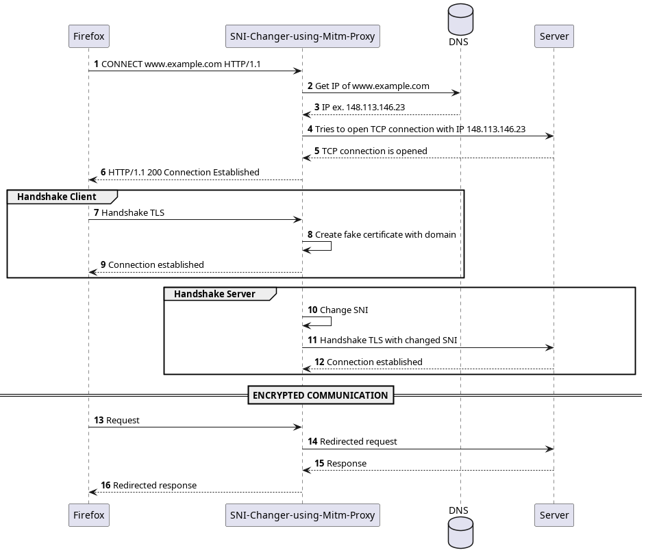

# SNI-Changer-using-Mitm-Proxy

## Overview

The SNI-Changer is a tool designed to change the SNI extension of the ClientHello message. To do this, a TLS connection is established with the user, pretending to be the server, thus providing a certificate signed by a user-created root certificate. With the target server, another TLS connection is established, modifying one of the extensions of the TLS protocol, the Server Name Indication (SNI). After both of these connections are in place, any data transmitted between the user and the server is redirected to the opposite party.



## What is the ClientHello message?
When a client (such as a web browser) initiates a secure connection with a server using HTTPS (HTTP Secure), it begins with a step called the "Client Hello." This initial message serves as a greeting and a request to establish a secure connection using the Transport Layer Security (TLS) protocol.

## What is SNI?
The Server Name Indication (SNI) is a part of the Client Hello message. It's especially important in scenarios where a single server hosts multiple websites or services, each with its own domain name and SSL/TLS certificate. Before SNI, servers could only present a single certificate, often for the default website hosted on the server. SNI resolves this challenge by enabling the client to specify the domain name it's trying to access during the Client Hello.

## Why change the SNI?
According to the paper [Efficiently Bypassing SNI-based HTTPS Filtering](https://dl.ifip.org/db/conf/im/im2015exp/137348.pdf), there are two different ways to change the SNI to bypass the Firewall:
- Bypassing Based on Backward Compatibility
- Bypassing Based on Shared Server Certificate

## Traffic Redirection
There are several approaches to redirecting traffic towards the application. Currently, the forwarder must support the **CONNECT** message, which is sent prior to establishing the TLS connection, specifying the destination domain.

The application was designed to work with **Firefox**, but with the appropriate message sent initially, all functionalities should operate as intended with any tool.

Forwarders that have been tested:

- Firefox (using proxy settings).
- CURL (using the --proxy option).

## Usage
1. Clone the repository.
```shell
    $ git clone https://github.com/vicnetto/SNI-Changer-using-MitM-Proxy
    $ cd SNI-Changer-using-MitM-Proxy
```
2. Create the root certificate to sign each server certificate created by the application.
```shell
    $ make cert
    Enter DES3 password: (enter a password to the key)
```
> OBS: You can create your own rootCA and use it in the application. Therefore, this step is necessary only if you don’t have one.
3. Add the created root certificate to the forwarder (or to the system).
- In Firefox: `Settings -> Privacy and Security -> Certificates -> View Certificates -> Authorities -> Import…` -> Choose the cert/rootCA.pem from the source folder.
4. Make the application.
```shell
    $ make
```
5. Configure te websites where SNI should be changed in `sni.conf`.
6. Run the application.
```shell
    # In case you created your certificate with make cert.
    $ ./sni-changer-using-mitm-proxy cert/rootCA.pem cert/rootCA.key <key-password>
    # If you have independently generated your own certificate.
    $ ./sni-changer-using-mitm-proxy <root-ca-location> <root-key-location> <key-password>
```
You can add the `--noverify` option in the end to disable server TLS certificate check.

7. Set the forwarder to the right port.
- In Firefox: `Setting -> General -> Network Settings -> Settings -> Manual Proxy Configuration`. In HTTPS Proxy, type: `localhost` and port `8080`.
8. **You’re good to go!** Next time, only **step 6 is necessary to run** the project.

## Credits
This tool was developed by Victor Netto, [Thibault Cholez](https://github.com/cholezth) and [Xavier Marchal](https://github.com/Nayald) of RESIST research group in [LORIA](https://www.loria.fr/fr/), France.
